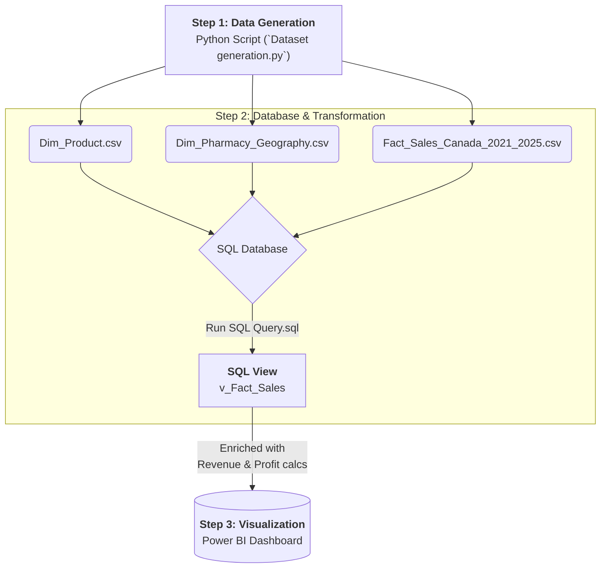

# Pharma Sales Analysis Project (2021-2025)

## Project Overview

This project is an end-to-end data analytics solution designed to analyze synthetic pharmaceutical sales data for Canada from 2021 to 2025. The entire workflow, from data generation to final visualization, is self-contained within this repository, demonstrating a full cycle of data processing and business intelligence.

The core objective is to process raw sales data, enrich it with business-critical metrics like **Revenue** and **Profit**, and present the findings in an interactive Power BI dashboard.

## Tech Stack

*   **Data Generation:** Python (Pandas, Numpy)
*   **Database & Transformation:** T-SQL (Microsoft SQL Server)
*   **Data Visualization:** Power BI

## Project Workflow

The project follows a structured workflow that mimics a real-world business intelligence environment.

---

## Breakdown of Project Components

### 1. Synthetic Data Generation (`Dataset generation.py`)

*   **What is this data?**
    The Python script generates three CSV files that form a **star schema**, a foundational model for data warehousing:
    *   `Fact_Sales_Canada_2021_2025.csv`: The central **fact table** containing transactional data like units sold, sale date, and foreign keys to the dimension tables.
    *   `Dim_Product.csv`: A **dimension table** with attributes about each drug, such as its name, category, and cost.
    *   `Dim_Pharmacy_Geography.csv`: A **dimension table** with details about each pharmacy, including its location.

*   **Why was synthetic data generated?**
    In professional settings, real sales data is highly confidential and proprietary. Generating synthetic data serves two key purposes:
    1.  **Demonstrates Initiative:** It shows the ability to create a complete, self-contained project without relying on pre-existing datasets.
    2.  **Showcases Data Structure Understanding:** It proves an understanding of how well-structured, relational data (like a star schema) should be designed for effective analysis.

### 2. Database & SQL Transformation (`SQL Query.sql`)

The generated CSV files are loaded into a SQL database, simulating a centralized data warehouse.

*   **Role of the SQL View (`v_Fact_Sales`)**
    Instead of connecting Power BI directly to the raw tables, a SQL **VIEW** is created. This is a crucial best practice for several reasons:
    1.  **Abstraction Layer:** It simplifies the data model for the reporting tool. The analyst using Power BI doesn't need to worry about the underlying table joins.
    2.  **Business Logic Encapsulation:** The VIEW is where raw data is transformed into meaningful business metrics. The SQL query calculates key performance indicators (KPIs) on-the-fly:
        *   `Revenue`: Calculated as `Units_Sold * Unit_WAC`
        *   `MFC_Cost`: The manufacturing cost.
        *   `Internal_Profit`: The final profit per transaction.
    3.  **Stability & Security:** It provides a stable interface. The underlying tables can be changed, but as long as the view's output remains consistent, the report will not break. It also provides a layer of security by exposing only the necessary data.

### 3. Visualization & Reporting (`Pharma Report.pbix`)

This is the final step where data is turned into actionable insights. The Power BI file connects directly to the `v_Fact_Sales` SQL view.

*   **Key Activities in Power BI:**
    *   **Data Modeling:** Defining relationships between the fact and dimension tables.
    *   **DAX Measures:** Creating additional calculations for aggregated insights.
    *   **Dashboard Creation:** Building interactive visuals to explore sales trends by product, region, time, and profitability.

## Dashboard Preview

*Overview of Total Sales and Profitability* 
    **: Understanding basic metrics like total sales and Revenue**

*Trend and Market Analysis*
    : Exploring trends, Class Segmentation Performance, identifying where we can address to avoid more revenue decrease.

*Sales Targeting*
    : Identifying who can we target for sales based on province, gender and pharmacy sales performance. Identifying if drug has proper market access through type of transactions. 
    Also measuring the Churn metric (showcasing how many patient are staying on the current medicaiton).

## How to Replicate This Project

1.  Run the `Dataset generation.py` script to create the three CSV files.
2.  Set up a SQL Server database and load the three CSV files as tables.
3.  Execute the `SQL Query.sql` script to create the `v_Fact_Sales` view.
4.  Open the `Pharma Report.pbix` file.
5.  Update the data source connection to point to your SQL Server instance and database.
6.  Explore the report!
